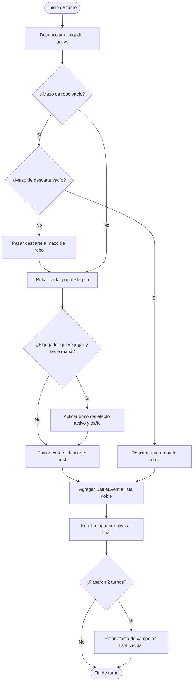

# Documentación de diseño y ejecución — RiftForge TCG

## Propósito

RiftForge es una simulación de duelo local para demostrar TDAs y estructuras
enlazadas implementadas con nodos propios. No utiliza `java.util.LinkedList`,
`Stack` ni `Queue`: las únicas colecciones de Java que aparecen son listas
temporales de salida para mostrar recorridos.

## Diagrama de flujo (plan de la jugada)

Este diagrama fue el plan que sigue `GameEngine.playTurn(boolean)`: primero se
obtiene un jugador de la cola, después se roba de la pila, se registra la
acción en la lista doble y al final el jugador vuelve a la cola. El efecto de
campo se rota cada dos turnos mediante la lista circular.



La notación cumple: óvalos para inicio/fin, rectángulos para procesos, rombos
para decisiones y flechas para la secuencia. Puede pegarse directamente en un
visor Mermaid o en GitHub para generar la imagen solicitada.

## Diseño e implementación

| Requisito | Implementación | Motivo y ejemplo práctico |
|---|---|---|
| Datos primitivos, complejos y TAD | `model/Card` | Es el TAD Carta: agrupa `name` (`String`, complejo), `manaCost`, `attack` y `health` (`int`, primitivos), además de `Element` y `CardType`. Tiene constructor validado, comportamiento `attackWithBonus` y `toString()` legible. |
| Lista simplemente enlazada | `structures/SinglyLinkedList<T>` y catálogo en `GameEngine` | Cada `Node` apunta al siguiente. `add`, `find`, `remove` y el iterador permiten registrar, buscar, eliminar y recorrer cartas. La opción `C` lo muestra. |
| Lista doblemente enlazada | `structures/DoublyLinkedList<T>` e historial `BattleEvent` | Cada nodo usa `next` y `previous`; `forward()` empieza en `head` y `backward()` en `tail`. La opción `H` muestra las dos direcciones. |
| Lista circular | `structures/CircularLinkedList<T>` y cuatro `Rift` | El último nodo apunta al primero. `rotate()` avanza Fuego → Tormenta → Vacío → Marea → Fuego sin final. `TURNS_PER_RIFT = 2` conserva cada efecto dos turnos. |
| Dos pilas | dos `LinkedStack<Card>` dentro de `Player` | `deck` es el mazo de robo y `graveyard` el descarte. `pop()` roba y `push()` descarta. Si el mazo se vacía, el motor recicla el descarte. |
| Cola de jugadores | `CircularQueue<Player>` en `GameEngine` | Es una cola FIFO circular: se desencola el jugador activo y se reencola al final. Así el siguiente queda al frente y los turnos se repiten. |

### Responsabilidad por archivo

| Archivo/clase | Responsabilidad |
|---|---|
| `app/Main.java` | Crea la partida de ejemplo, registra 4 efectos y procesa comandos de consola. |
| `engine/GameEngine.java` | Reglas de turno, reciclaje de mazo, daño, historial y rotación de efectos. |
| `model/Card.java` | TAD Carta y cálculo del bono de ataque. |
| `model/Player.java` | Vida, maná y posesión de las dos pilas. |
| `model/Rift.java` | Efecto de campo inmutable. |
| `model/BattleEvent.java` | Registro inmutable de una jugada. |
| `model/Element.java`, `CardType.java` | Valores cerrados de elemento y tipo. |
| `structures/Node.java` | Nodo interno reutilizable (`data`, `next`, `previous`). |
| `structures/SinglyLinkedList.java` | Catálogo enlazado simple genérico. |
| `structures/DoublyLinkedList.java` | Historial enlazado doble genérico. |
| `structures/CircularLinkedList.java` | Ciclo genérico de efectos. |
| `structures/LinkedStack.java` | Pila enlazada LIFO genérica. |
| `structures/CircularQueue.java` | Cola circular enlazada para iniciativa. |
| `ui/ConsoleRenderer.java` | Presentación de estado, catálogo e historial; no contiene reglas. |

## Ejecución

Desde la raíz del proyecto:

```bash
mkdir -p out
javac -d out $(find java/src -name '*.java')
java -cp out riftforge.app.Main
```

Comandos: `J` juega, `D` descarta, `C` recorre el catálogo, `H` recorre el
historial en ambos sentidos, `Q` reinicia y `X` termina.

## Casos de uso, evidencia y resultados

| Caso probado | Resultado esperado | Resultado observado |
|---|---|---|
| `C` al iniciar | Se recorren las cuatro cartas de la lista simple. | Se imprimen Caballero, Mago, Dragón y Monstruo (en orden inverso al registro por inserción en cabeza). |
| Dos `J` consecutivos | Se roba con pila, se descarta, se registran dos eventos, cambia el frente de la cola y rota el efecto. | Los dos eventos aparecen en `H`; el segundo turno termina Fuego Ígneo y el tercero muestra Tormenta Eléctrica. |
| `H` después de dos turnos | El historial se puede leer primero→último y último→primero. | Se muestran las mismas dos jugadas en orden contrario en cada bloque. |
| Mazo agotado con descarte disponible | Se mueve el descarte al mazo y se puede volver a robar. | `recycleDeckIfNeeded` transfiere cada carta con `pop`/`push` antes del robo. |
| Sin cartas en ambas pilas | No hay excepción; se registra que el jugador no puede robar. | Se crea un `BattleEvent` y el turno pasa al siguiente jugador. |

Ejemplo de captura de consola reproducible para los dos primeros turnos:

```text
[TURNO 1] Ana -> siguiente: Beto
> Ana invoca Monstruo de Agua e inflige 3 a Beto.
[TURNO 2] Beto -> siguiente: Ana
> Beto invoca Caballero de Fuego e inflige 7 a Ana.
--- Historial hacia adelante (primera jugada primero) ---
> Turno 1: Ana invoca Monstruo de Agua e inflige 3 a Beto.
> Turno 2: Beto invoca Caballero de Fuego e inflige 7 a Ana.
--- Historial hacia atrás (más reciente primero) ---
> Turno 2: Beto invoca Caballero de Fuego e inflige 7 a Ana.
> Turno 1: Ana invoca Monstruo de Agua e inflige 3 a Beto.
```

## Complejidad relevante

`push`, `pop`, `enqueue`, `dequeue`, `addLast` y la rotación circular son
O(1). Buscar o eliminar una carta y recorrer un historial/catálogo son O(n).
El `add` actual de la lista circular busca la cola para conservar el orden de
configuración, por lo que es O(n), una decisión aceptable porque los cuatro
efectos se cargan una sola vez al iniciar la partida.
