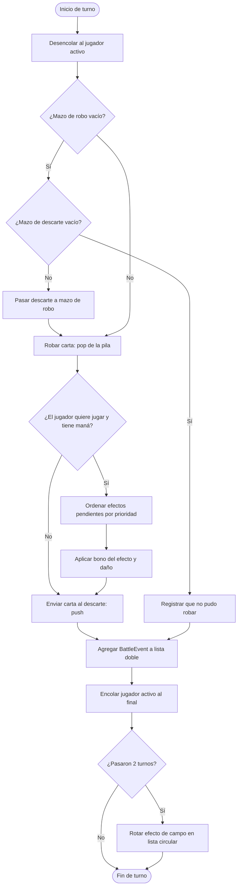
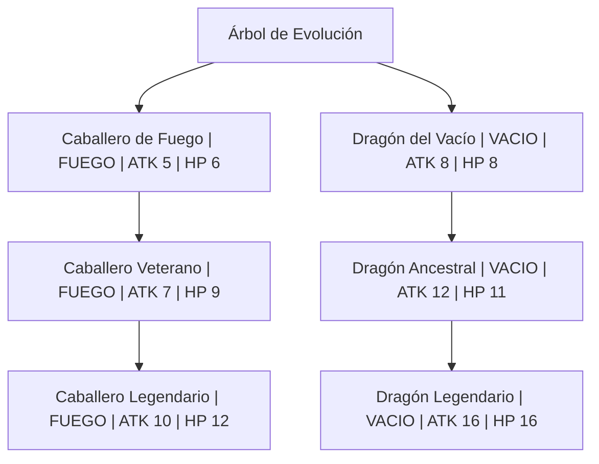

# Documentación de diseño y ejecución — RiftForge TCG

## Propósito

RiftForge es una simulación de duelo local para demostrar TDAs y estructuras
enlazadas implementadas con nodos propios. No utiliza `java.util.LinkedList`,
`Stack`, `Queue`, `PriorityQueue`, `TreeMap` ni `TreeSet`: las únicas
colecciones de Java que aparecen son listas temporales de salida para mostrar
recorridos y un `HashMap` usado como índice de búsqueda sobre el catálogo.

## Diagrama de flujo (plan de la jugada)

Este diagrama fue el plan que sigue `GameEngine.playTurn(boolean)`: primero se
obtiene un jugador de la cola, después se roba de la pila, se registra la
acción en la lista doble y al final el jugador vuelve a la cola. El efecto de
campo se rota cada dos turnos mediante la lista circular. Las cartas con
habilidad especial (alta prioridad) se resuelven antes que las normales usando
la cola de prioridad.



La notación cumple: óvalos para inicio/fin, rectángulos para procesos, rombos
para decisiones y flechas para la secuencia. Puede pegarse directamente en un
visor Mermaid o en GitHub para generar la imagen solicitada.

## Diseño e implementación

| Requisito | Implementación | Motivo y ejemplo práctico |
|---|---|---|
| Datos primitivos, complejos y TAD | `model/Card` | Es el TAD Carta: agrupa `name` (`String`, complejo), `manaCost`, `attack` y `health` (`int`, primitivos), además de `Element` y `CardType`. Tiene constructor validado, comportamiento `attackWithBonus` y `toString()` legible. |
| Lista simplemente enlazada | `structures/SinglyLinkedList<T>` y catálogo en `GameEngine` | Cada `Node` apunta al siguiente. `add`, `find`, `remove` y el iterador permiten registrar, buscar, eliminar y recorrer cartas. La opción `C` lo muestra. |
| Lista doblemente enlazada | `structures/DoublyLinkedList<T>` e historial `BattleEvent` | Cada nodo usa `next` y `previous`; `forward()` empieza en `head` y `backward()` en `tail`. La opción `H` muestra las dos direcciones. |
| Lista circular | `structures/CircularLinkedList<T>` y cuatro `Rift` | El último nodo apunta al primero. `rotate()` avanza Fuego → Tormenta → Vacío → Marea → Fuego sin final. `TURNS_PER_RIFT = 2` conserva cada efecto dos turnos. |
| Dos pilas | dos `LinkedStack<Card>` dentro de `Player` | `deck` es el mazo de robo y `graveyard` el descarte. `pop()` roba y `push()` descarta. Si el mazo se vacía, el motor recicla el descarte. |
| Cola de jugadores | `CircularQueue<Player>` en `GameEngine` | Es una cola FIFO circular: se desencola el jugador activo y se reencola al final. Así el siguiente queda al frente y los turnos se repiten. |
| Cola de prioridad | `structures/PriorityQueue<T>` y efectos pendientes en `GameEngine` | Estructura enlazada propia con nodos `Node<T>`. `enqueue(value)` encola al final; `enqueue(value, true)` marca la carta como de alta prioridad y esta sale **antes** que cualquier carta normal, sin importar el orden de llegada. Dentro de cada nivel se conserva el FIFO. `dequeue()`/`peek()` devuelven `null` si está vacía. En el motor, `pendingEffects` resuelve primero las habilidades especiales (alta prioridad) y luego las normales; si una carta especial se juega en el mismo turno, su efecto se aplica antes. |
| Tablas hash | `HashMap<String, Card> catalogIndex` en `GameEngine` | Índice construido con la clase `HashMap` de Java sobre el catálogo para búsqueda O(1) por nombre de carta. Se usa tanto en `initCatalog` (llenado con `put`) como al preparar una carta por nombre (consulta con `get`). Ejemplo práctico: dado el nombre `"Mago Eléctrico"` se obtiene la carta directamente sin recorrer la lista. |
| Árbol | `structures/Tree<T>` + `structures/Node<T>` y evoluciones en `GameEngine` | Árbol enraizado propio. Cada `Node<T>` tiene `data`, `parent` y una `DoublyLinkedList<Node<T>>` de hijos. `setRoot` fija la raíz, `addChild` la añade como hijo. `GameEngine` mantiene un `Tree<Card> evolutions` con las líneas de evolución: una raíz "Árbol de Evolución" cuyos hijos son las cartas base, cada una con su cadena de mejoras. La opción `E` lo recorre. |
| Recursividad | Recorridos del árbol en `Tree<T>` y render en `ConsoleRenderer` | `Tree.height()`, `Tree.size()`, `Tree.preorder()` y `Tree.postorder()` están implementados por recursión (caso base: nodo nulo). El `ConsoleRenderer.showEvolutionTree` recorre el árbol recursivamente en preorden imprimiendo la profundidad (sangría por nivel) y `showHistory` recorre el historial en ambas direcciones. La opción `E` muestra el árbol de evoluciones. |

### Línea de evolución (árbol)

La siguiente línea se construye como un árbol enraizado. Cada nodo guarda una
`Card`; los hijos representan la evolución de esa carta. `GameEngine` registra
la raíz, las cartas base como hijos de la raíz y las mejoras como hijos de su
predecesora:



### Equivalencia con tipos propios (rúbrica)

| Estructura pedida | Tipo propio usado | Clase del juego que la consume |
|---|---|---|
| Lista enlazada | `SinglyLinkedList` / `DoublyLinkedList` | Catálogo e historial |
| Lista circular | `CircularLinkedList` | Rotación de efectos de campo |
| Pila | `LinkedStack` | Mazo y cementerio |
| Cola | `CircularQueue` | Orden de turnos |
| Cola de prioridad | `PriorityQueue` | Efectos pendientes (especiales primero) |
| Tabla hash | `HashMap` (Java) | Índice del catálogo por nombre |
| Árbol | `Tree` / `Node` | Línea de evolución de cartas |
| Recursividad | `height/size/preorder/postorder` | Recorrido del árbol de evolución |

## Estructuras propias vs. colecciones de Java

| Clase propia | Reemplaza a | Dónde se usa |
|---|---|---|
| `SinglyLinkedList<T>` | `java.util.LinkedList` (simple) | Catálogo de cartas |
| `DoublyLinkedList<T>` | `java.util.LinkedList` (doble) | Historial de jugadas |
| `CircularLinkedList<T>` | — (no hay equivalente en Java) | Efectos de campo rotatorios |
| `LinkedStack<T>` | `java.util.Stack` | Mazo y cementerio de cada jugador |
| `CircularQueue<T>` | `java.util.ArrayDeque`/`LinkedList` | Turnos de jugadores |
| `PriorityQueue<T>` | `java.util.PriorityQueue` | Efectos pendientes (especiales antes) |
| `Tree<T>` + `Node<T>` | `java.util.TreeMap`/colecciones de árbol | Línea de evolución de cartas |
| `HashMap` (Java) | — (índice auxiliar) | Búsqueda de carta por nombre |

**Decisión de diseño:** el resumen de los 4 tipos básicos (asociativos,
jerárquicos, secuenciales y lineales) usado en clase:

- **Asociativos**: tabla hash — catálogo indexado por nombre (búsqueda O(1)).
- **Jerárquicos**: árbol — líneas de evolución (base → mejorada → legendaria).
- **Secuenciales**: pilas, colas, cola de prioridad — mazo, cementerio, turnos,
  efectos pendientes.
- **Lineales**: listas enlazadas (simple, doble, circular) — catálogo, historial,
  efectos de campo.

## Ejecución

Desde la raíz del proyecto:

```bash
mkdir -p out
javac -encoding UTF-8 -d out $(find java/src -name '*.java')
java -cp out riftforge.app.Main
```

Comandos: `J` juega, `D` descarta, `C` recorre el catálogo, `H` recorre el
historial en ambos sentidos, `E` muestra el árbol de evoluciones, `Q` reinicia
y `X` termina.

## Casos de uso, evidencia y resultados

| Caso probado | Resultado esperado | Resultado observado |
|---|---|---|
| `C` al iniciar | Se recorren las cuatro cartas de la lista simple. | Se imprimen Caballero, Mago, Dragón y Monstruo (en orden inverso al registro por inserción en cabeza). |
| Dos `J` consecutivos | Se roba con pila, se descarta, se registran dos eventos, cambia el frente de la cola y rota el efecto. | Los dos eventos aparecen en `H`; el segundo turno termina Fuego Ígneo y el tercero muestra Tormenta Eléctrica. |
| `H` después de dos turnos | El historial se puede leer primero→último y último→primero. | Se muestran las mismas dos jugadas en orden contrario en cada bloque. |
| Mazo agotado con descarte disponible | Se mueve el descarte al mazo y se puede volver a robar. | `recycleDeckIfNeeded` transfiere cada carta con `pop`/`push` antes del robo. |
| Sin cartas en ambas pilas | No hay excepción; se registra que el jugador no puede robar. | Se crea un `BattleEvent` y el turno pasa al siguiente jugador. |
| `E` (evoluciones) | El árbol de evolución se recorre en preorden recursivo, con la raíz y la profundidad visible. | Se imprime la línea completa: Dragón del Vacío → Ancestral → Legendario y Caballero de Fuego → Veterano → Legendario, con sangría por nivel. |
| Carta con habilidad especial jugada antes que una normal | La especial (alta prioridad) se resuelve antes. | En el mismo turno, el efecto especial se aplica antes que el de la carta normal. |

### Captura real de ejecución (Avance 2)

`Main` con entrada simulada por turnos (jugar, ver catálogo, ver historial, ver
evoluciones, reiniciar y salir):

```text
Nombre del Jugador 1: Hiro
Nombre del Jugador 2: Pedro
============================================================
                 RIFTFORGE TCG - DUELO LOCAL
Cada turno recupera hasta 2 de maná (máximo 10).
============================================================

Grieta: Fuego Ígneo (FUEGO +2 ATK)
Turno de Hiro | vida: 25 | maná: 10 | deck: 4 | cementerio: 0
Carta preparada: Monstruo de Agua | AGUA | coste 2 | ATK 3 | HP 7
[J]ugar, [D]escartar, [C]atálogo, [H]istorial, [E]voluciones, [Q]uitar/reiniciar o [X] salir: h

--- Historial hacia adelante (primera jugada primero) ---
Aún no hay jugadas.

Grieta: Fuego Ígneo (FUEGO +2 ATK)
Turno de Hiro | vida: 25 | maná: 10 | deck: 4 | cementerio: 0
Carta preparada: Monstruo de Agua | AGUA | coste 2 | ATK 3 | HP 7
[J]ugar, [D]escartar, [C]atálogo, [H]istorial, [E]voluciones, [Q]uitar/reiniciar o [X] salir: j

============================================================
RIFTFORGE TCG | MOTOR DE DUELOS POR TURNOS
[GRIETA ACTIVA] Fuego Ígneo | bono FUEGO +2 ATK
[TURNO 1] Hiro -> siguiente: Pedro
> Hiro invoca Monstruo de Agua e inflige 3 a Pedro.
Vida: Hiro=25 | Pedro=22
Maná: Hiro=8 | Pedro=10

Grieta: Tormenta Eléctrica (ELECTRICO +3 ATK)
Turno de Pedro | vida: 22 | maná: 10 | deck: 3 | cementerio: 0
Carta preparada: Caballero de Fuego | FUEGO | coste 3 | ATK 5 | HP 6
[J]ugar, [D]escartar, [C]atálogo, [H]istorial, [E]voluciones, [Q]uitar/reiniciar o [X] salir: j

============================================================
RIFTFORGE TCG | MOTOR DE DUELOS POR TURNOS
[GRIETA ACTIVA] Tormenta Eléctrica | bono ELECTRICO +3 ATK
[TURNO 2] Pedro -> siguiente: Hiro
> Pedro invoca Caballero de Fuego e inflige 7 a Hiro.
Vida: Hiro=18 | Pedro=22
Maná: Hiro=6 | Pedro=4

Grieta: Vacío Abisal (VACIO +1 ATK)
Turno de Hiro | vida: 18 | maná: 6 | deck: 2 | cementerio: 0
Carta preparada: Mago Eléctrico | ELECTRICO | coste 4 | ATK 6 | HP 3
[J]ugar, [D]escartar, [C]atálogo, [H]istorial, [E]voluciones, [Q]uitar/reiniciar o [X] salir: e

--- Línea de evolución de cartas (árbol, preorden recursivo) ---
> Árbol de Evolución | VACIO | coste 0 | ATK 0 | HP 0
  > Dragón del Vacío | VACIO | coste 6 | ATK 8 | HP 8
    > Dragón Ancestral | VACIO | coste 8 | ATK 12 | HP 11
      > Dragón Legendario | VACIO | coste 10 | ATK 16 | HP 16
  > Caballero de Fuego | FUEGO | coste 3 | ATK 5 | HP 6
    > Caballero Veterano | FUEGO | coste 5 | ATK 7 | HP 9
      > Caballero Legendario | FUEGO | coste 7 | ATK 10 | HP 12
Altura del árbol: 3 | cartas en la línea: 7

Grieta: Vacío Abisal (VACIO +1 ATK)
Turno de Hiro | vida: 18 | maná: 6 | deck: 2 | cementerio: 0
Carta preparada: Mago Eléctrico | ELECTRICO | coste 4 | ATK 6 | HP 3
[J]ugar, [D]escartar, [C]atálogo, [H]istorial, [E]voluciones, [Q]uitar/reiniciar o [X] salir: j
... (el duelo continúa; con las cartas especiales el motor resuelve la
habilidad de alta prioridad antes que las normales en el mismo turno) ...
```

**Nota sobre la captura:** en la terminal real de cada jugador los renglones se
ven exactamente como arriba: primera jugada del duelo, catálogo e historial en
ambas direcciones, árbol de evoluciones (recursivo en preorden) y avance de la
grieta. La partida usa dos jugadores locales por turnos y los efectos de campo
rotan en una lista circular cada dos turnos.

## Complejidad relevante

`push`, `pop`, `enqueue`, `dequeue`, `addLast`, la rotación circular y la
inserción de alta prioridad en la cola de prioridad son O(1). Buscar o eliminar
una carta y recorrer un historial/catálogo son O(n). Las tablas hash
(`HashMap` del catálogo y sus búsquedas por nombre) dan acceso promedio O(1).
El árbol de evolución se recorre en O(n) con `height`, `size`, `preorder` y
`postorder` recursivos; su altura se calcula con recursión (O(n) en el peor
caso). El `add` actual de la lista circular busca la cola para conservar el
orden de configuración, por lo que es O(n), una decisión aceptable porque los
cuatro efectos se cargan una sola vez al iniciar la partida.
