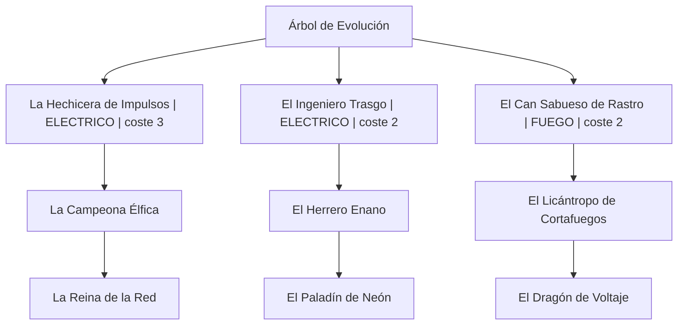
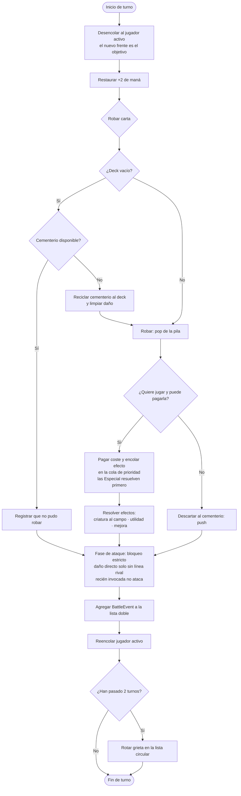

# RiftForge TCG

Duelo local de cartas por turnos (2 jugadores) en Java puro. Demuestra los TDAs
y estructuras enlazadas de la asignatura implementados **con nodos propios**, sin
usar `java.util.LinkedList`, `Stack`, `Queue`, `Deque`, `PriorityQueue`,
`TreeMap` ni `TreeSet`, y **sin** `Arrays.sort` y `Collections.sort`. Incluye
interfaz gráfica (Swing) y un modo consola alternativo.

Este documento es la documentación única del proyecto: diseño, estructuras,
reglas, interfaz, ejecución y empaquetado.

---

## 1. Estructura del proyecto

```
java/src/riftforge/
├── app/        Startup (partida lista para jugar) y Main (punto de entrada)
├── data/       CardDatabase: lee la ficha de cartas (cards2.csv)
├── engine/     GameEngine: reglas de la jugada (no imprime nada)
│   └── tests/  GameEngineTest: suite de verificación
├── model/      TDAs del dominio: Card, CardType, Element, Player, Rift, BattleEvent
├── sort/       OwnSorter: Insertion Sort propio sobre copias
├── structures/ Nodos y TDAs genéricos
└── ui/         ConsoleRenderer (consola) y gui/ (ventana Swing)
```

| Package | Responsabilidad | Clases principales |
|---|---|---|
| `riftforge.model` | Datos y reglas locales del dominio | `Card`, `CardType`, `Element`, `Player`, `Rift`, `BattleEvent` |
| `riftforge.structures` | Nodos y TDAs genéricos | `Node`, `SinglyLinkedList`, `DoublyLinkedList`, `CircularLinkedList`, `LinkedStack`, `CircularQueue`, `PriorityQueue`, `Tree` |
| `riftforge.sort` | Ordenamiento propio (Entregable) | `OwnSorter` (`insertionSortByCost`) |
| `riftforge.data` | Ficha de cartas y validación | `CardDatabase` (Carga CSV, entidad `CardRow`) |
| `riftforge.engine` | Coordina una jugada; no imprime | `GameEngine` |
| `riftforge.engine.tests` | Verificación automática | `GameEngineTest` (13 escenarios, 29 comprobaciones) |
| `riftforge.ui.gui` | Interfaz gráfica Swing | `GameWindow`, `CardView`, `Theme`, `Typeface`, `ImageStore`, `BackgroundStore`, `Resources` |
| `riftforge.ui` | Render del estado en consola | `ConsoleRenderer` |
| `riftforge.app` | Preparación de partida y arranque | `Main`, `Startup` |

Regla de dependencias: `app → ui/gui + data → ui/engine → model/structures`.
`structures` y `sort` no conocen cartas, jugadores, consola ni interfaz.

---

## 2. Origen de los datos: `cards2.csv`

40 cartas en un único CSV (`java/resources/cards2.csv`, que también viaja dentro
del JAR en la raíz del classpath). La cabecera admite sinónimos de columna
(`categoria/grupo/tipo`, `coste_flux/coste/mana`, etc.):

| Columna | Significado |
|---|---|
| `card_uid` | identificador breve; nombra la imagen `<uid>.jpeg` |
| `categoria` | `Personaje` / `Criatura` → `CRIATURA`; `Utilidad` → `HECHIZO`; `Mejora` → `EQUIPO` |
| `nombre`, `coste_flux`, `ataque_mod`, `defensa_durabilidad` | valores de la carta |
| `descripcion_efecto` | texto de la habilidad (se conserva siempre) |
| `Elemento` | opcional; vacío → `ELECTRICO` |
| `Especial` | opcional `si/no`; marca prioridad alta en la cola de resolución |
| `Evoluciona_de` | opcional; uid del padre para armar el árbol (el padre precede al hijo) |

Composición de la ficha:

| Categoría | N.º | Coste de maná |
|---|---|---|
| Personaje | 14 | 2 – 7 |
| Criatura | 6 | 2 – 8 |
| Utilidad | 10 | 1 – 5 |
| Mejora | 10 | 2 – 6 |

Los elementos cubren las 6 grietas: `FUEGO` (8), `VACIO` (11), `ELECTRICO` (11),
`AGUA` (5), `SOMBRA` (3) y `DRAGON` (2) — el recuento incluye el valor por
defecto de las filas sin elemento. El reparto crea dos mazos de 20 cartas.

---

## 3. Reglas del duelo

- **Maná:** empieza en 6 (`Startup.STARTING_MANA`); cada turno recupera +2,
  tope 10. Algunas Utilidades devuelven maná adicional.
- **Vida:** 30 por jugador (`Startup.STARTING_LIFE`).
- **Grietas:** 6, una por elemento, rotan en lista circular cada 2 turnos
  (`TURNS_PER_RIFT`). La activa suma su bono de ataque **solo a las criaturas de
  ese elemento** (`Card.attackWithBonus`).
- **Turno:** se desencola al jugador activo (el siguiente en la cola es el
  objetivo), se restauran +2 de maná, se roba del tope del deck y se elige
  jugar o descartar. Si el deck está vacío, el cementerio se recicla al deck
  (limpiando el daño acumulado) para que no haya inanición.
- **Al jugar:** se paga el coste y el efecto entra en una **cola de prioridad**
  donde las cartas `Especial` resuelven antes que las normales (FIFO dentro de
  cada nivel):
  - **Criatura** (Personaje o Criatura): se coloca en el campo.
  - **Utilidad** (HECHIZO): ejecuta el efecto que su nombre describe sobre
    recursos/vida/blindaje/bono de campo.
  - **Mejora** (EQUIPO): requiere una criatura en campo; suma ATQ permanente al
    campo y un blindaje absorbente.
- **Fase de ataque — bloqueo estricto:** las criaturas en campo golpean en
  orden a la línea enemiga (la primera bloquea; si muere, pasa el daño al
  siguiente). El exceso de daño contra una criatura **se pierde** (no hay
  trample). El rival solo recibe **daño directo** cuando su campo queda vacío.
  El blindaje absorbe antes que la vida. Las Mejoras aportan un +ATQ que se
  aplica al primer atacante.
- **Fatiga de invocación:** la criatura recién jugada no ataca en ese turno
  (pero bloquea y puede recibir daño en el turno del rival).
- **Daño en cartas:** se acumula dentro de la propia `Card`
  (`damageTaken` / `remainingHealth` / `isDestroyed`); al destruirse va al
  cementerio y su daño se limpia al reciclar.
- **Victoria:** reducir la vida rival a 0.

### Líneas de evolución reales (del CSV)



---

## 4. Relación entre requisito y TDA

| Requisito | TDA/propia | Uso en el juego | Operación clave |
|---|---|---|---|
| Datos primitivos, complejos y TAD | `model/Card` | El TAD Carta: `name` (complejo), `manaCost`/`attack`/`health` (primitivos), `Element` y `CardType`; constructor validado y estado de daño | `attackWithBonus()`, `takeDamage()` |
| Lista simple | `SinglyLinkedList<T>` | Catálogo (`GameEngine.catalog`) y campo de batalla de cada jugador (`Player.field`) | `add`, `find`, `remove`, iterador |
| Lista doble | `DoublyLinkedList<T>` | Historial de combate (`BattleEvent`) | `forward()` desde head, `backward()` desde tail |
| Lista circular | `CircularLinkedList<T>` | Las 6 grietas elementales | `rotate()` cada 2 turnos |
| Dos pilas | dos `LinkedStack<Card>` por jugador | Deck y cementerio | robar con `pop()`, descartar con `push()`, reciclaje |
| Cola circular | `CircularQueue<Player>` | Iniciativa: desencolar al activo y reencolarlo al final | `dequeue()` / `enqueue()` |
| Cola de prioridad | `PriorityQueue<Card>` | Efectos pendientes: las `Especial` salen primero, FIFO dentro del nivel | `enqueue(value, true)` |
| Tabla hash | `HashMap<String, Card>` | Índice del catálogo por nombre normalizado: búsqueda O(1) | `put` / `get` |
| Árbol | `Tree<T>` + `Node<T>` | Línea de evolución (base → mejorada → legendaria) | `setRoot`, `addChild`, recorridos recursivos |
| Recursividad | `height/size/preorder/postorder` del árbol | Ranking y render del árbol de evoluciones (opción `E`) | recorrido en preorden con sangría |
| Ordenamiento (Entregable) | `sort/OwnSorter` | Ordenar el catálogo por coste para el reparto y la vista de colección | `insertionSortByCost(List<Card>)` (estable, O(n²)) |

---

## 5. Estructuras propias vs. colecciones de Java

| Clase propia | Reemplaza a | Dónde se usa |
|---|---|---|
| `SinglyLinkedList<T>` | `java.util.LinkedList` (simple) | Catálogo y campo de batalla |
| `DoublyLinkedList<T>` | `java.util.LinkedList` (doble) | Historial de jugadas |
| `CircularLinkedList<T>` | — | Grietas elementales rotatorias |
| `LinkedStack<T>` | `java.util.Stack` | Deck y cementerio de cada jugador |
| `CircularQueue<T>` | `ArrayDeque`/`LinkedList` | Turnos de jugadores |
| `PriorityQueue<T>` | `java.util.PriorityQueue` | Efectos pendientes (especiales antes) |
| `Tree<T>` + `Node<T>` | colecciones de árbol | Línea de evolución de cartas |
| `OwnSorter` | `Arrays.sort` / `Collections.sort` | Ordenamiento por coste de maná |
| `HashMap` (Java) | — (índice auxiliar permitido) | Búsqueda de carta por nombre |

**Decisión de diseño** — los 4 tipos básicos:

- **Asociativos**: tabla hash — catálogo indexado por nombre (O(1)).
- **Jerárquicos**: árbol — líneas de evolución (base → mejorada → legendaria).
- **Secuenciales**: pilas, cola circular y cola de prioridad — mazo, cementerio,
  turnos y efectos pendientes.
- **Lineales**: listas simple/doble/circular — catálogo, campo, historial, grietas.

---

## 6. Flujo de `GameEngine.playTurn(boolean)`

1. Saca de la cola circular al jugador activo; el nuevo frente de la cola se
   convierte en el objetivo.
2. Restaura +2 de maná del activo (tope 10).
3. Roba la carta del tope del deck; si está vacío, recicla el cementerio al
   deck (`pop`/`push`, limpiando el daño) y vuelve a intentar.
4. Si no hay carta, o el jugador no quiere jugar, o no puede pagarla: la carta
   se descarta al cementerio. En otro caso se paga el coste y el efecto entra en
   la cola de prioridad (especiales primero).
5. Se resuelven los efectos pendientes: criatura al campo, utilidad según su
   nombre, mejora equipada (+ATQ campo y blindaje) si hay criatura.
6. **Fase de ataque** (bloqueo estricto): las criaturas del campo del activo
   golpean a la línea enemiga; el exceso de daño se pierde, y solo con el campo
   rival vacío el daño es directo al rival (más blindaje absorbente). La recién
   invocada no ataca.
7. Se agrega un `BattleEvent` al final de la lista doble (historial).
8. Se reencola al jugador activo; cada 2 turnos rota la lista circular de
   grietas.



---

## 7. Complejidad relevante

- O(1): `push`/`pop`, `enqueue`/`dequeue`, `addLast` de la lista doble, la
  rotación circular (`current`), la inserción en la cola de prioridad y el
  `put`/`get` del `HashMap`.
- O(n): buscar o eliminar una carta del catálogo, recorrer historial/catálogo,
  y los recorridos del árbol (`height`, `size`, `preorder`, `postorder`).
- O(n²) peor caso, estable y sobre una copia: `OwnSorter.insertionSortByCost`
  (motivado para conjuntos de decenas de cartas y trazable a mano).
- El `add` actual de la lista circular busca la cola para conservar el orden de
  configuración: O(n), aceptable porque las 6 grietas se cargan una sola vez.

---

## 8. Interfaces

### 8.1 Consola (`java -jar RiftForge.jar --console`)

Cada turno muestra el estado (vida, maná, deck, cementerio, blindaje, campo con
vidas restantes), la grieta activa y la carta a robar. Teclas:

| Tecla | Acción |
|---|---|
| `J` | Jugar la carta robada |
| `D` | Descartarla al cementerio |
| `C` | Recorrer el catálogo (lista simple, ordenado por coste) |
| `H` | Historial hacia delante y hacia atrás (lista doble) |
| `E` | Árbol de evoluciones (recursivo en preorden) |
| `Q` | Terminar la partida y comenzar otra |
| `X` | Salir |

Fragmento real de una partida:

```text
Grieta: Fuego Ígneo (FUEGO +2 ATK)
Hiro | vida: 30 | maná: 6 | deck: 20 | cementerio: 0 | blindaje: 0
  campo: (vacío)
Carta a robar: La Valquiria de Plasma | FUEGO | coste 6 | ATK 7 | HP 5
[J]ugar, [D]escartar, [C]atálogo, [H]istorial, [E]voluciones, [Q]uitar/reiniciar o [X] salir:

RIFTFORGE TCG | MOTOR DE DUELOS POR TURNOS
[GRIETA ACTIVA] Fuego Ígneo | bono FUEGO +2 ATK
[TURNO 1] Hiro -> siguiente: Pedro
> Hiro juega la criatura La Valquiria de Plasma (coste 6) y la coloca en su campo.
El campo de Hiro ataca: La Valquiria de Plasma (recién invocada, no ataca).
Vida: Hiro=30 | Pedro=30
Maná: Hiro=2 | Pedro=6

[TURNO 3] Hiro -> siguiente: Pedro
> Hiro equipa la Mejora El Filo de Datos en su campo: +3 ATQ permanente y +0 de blindaje.
El campo de Hiro ataca: La Valquiria de Plasma golpea a Pedro por 10, daño directo a Pedro: 10.
```

### 8.2 Interfaz gráfica (Swing)

Ventana única con:

- **Cabecera:** marca "RIFT-FORGE TCG", turno y grieta actual (el bono se tiñe
  del elemento), y botones *Catálogo*, *Historial*, *Evoluciones*, *Barajar*,
  *Reiniciar* y *Salir*.
- **Zona rival (arriba)** y **zona activa (abajo):** paneles de cristal
  translúcido con nombre, mazo/cementerio/blindaje, barras de vida (se enciende
  en rojo ≤ 5) y maná, y el campo de criaturas.
- **Sala central:** la *Bitácora del duelo* (historial en una terminal con
  fuente monoespaciada) y la mano del jugador activo con la **próxima carta**
  en grande, botón *Jugar* y botón *Descartar*.
- **Cartas:** `CardView` pinta el arte (`cards/<uid>.jpeg`), nombre, tipo,
  elemento, chips de coste/ATQ/DEF; cuando una criatura está dañada, su chip
  DEF cambia a ámbar y muestra `restante/base`.
- **Fondos:** `BackgroundStore` carga `backgrounds/board`, `table` y `log` y los
  pinta con una veladura oscura (degradado por defecto si faltan). Las zonas
  interiores son `GlassPanel` translúcidos para que el arte se vea alrededor.
- **Tipografía:** `Typeface` aplica tres roles — `display` (Orbitron, títulos y
  números), `body` (Rajdhani, interfaz y cartas) y `mono` (Share Tech Mono,
  bitácora y diálogos) — con archivos en `java/resources/fonts/` y respaldo de
  sistema.
- **Recursos:** `Resources` abre cada recurso primero desde el **classpath**
  (dentro del JAR) y cae a `java/resources` en modo desarrollo. Así la app
  empaquetada no depende del directorio de trabajo.

---

## 9. Ejecución en desarrollo

Desde la raíz del proyecto:

```bash
mkdir -p out
javac -encoding UTF-8 -d out $(find java/src -name '*.java')
java -cp out riftforge.app.Main          # interfaz gráfica
java -cp out riftforge.app.Main --console  # modo consola
```

Verificación automática (13 escenarios, 29 comprobaciones):

```bash
java -cp out riftforge.engine.tests.GameEngineTest
```

---

## 10. Empaquetado y distribución

### macOS

`build.sh` genera todo con un comando: compila → JAR autocontenido → runtime
ligero con `jlink` → `RiftForge.app` y el instalador `RiftForge-1.0.dmg`
(icono derivado de `backgrounds/table`).

Entregables:

- `dist/RiftForge-1.0.dmg` — instalador a arrastrar a **Aplicaciones**
  (incluye su propio Java, ~83 MB). Al abrir por primera vez, Gatekeeper puede
  mostrar "desarrollador no verificado" por no estar notarizada: clic derecho →
  *Abrir*, o `xattr -dr com.apple.quarantine dist/RiftForge-1.0.dmg`.
- `dist/RiftForge.app` — app portable sin instalar.
- `RiftForge.jar` — `java -jar RiftForge.jar` (requiere Java).

### Windows

`jpackage` no cruza plataformas, así que el instalador MSI se genera **en una
PC con Windows** mediante `build-windows.bat` (JDK 17+ y, para el MSI, WiX
Toolset 3.11; sin WiX genera una app portable en `dist`). El guion replica el
flujo de `build.sh`: compila → JAR autocontenido → `jlink` → `jpackage --type msi`
(cartel de inicio). El JAR es 100 % portable entre plataformas.

---

## 11. Casos de uso y evidencia

| Caso probado | Resultado esperado | Resultado observado |
|---|---|---|
| `C` al iniciar | El catálogo se recorre y se ve ordenado por coste con el sort propio | Lista simple + `insertionSortByCost`; la vista de colección no altera la lista original |
| `J` repetidas | Rozar la pila, invocar criaturas, atacar con bloqueo y fatiga | Criaturas al campo; la recién invocada no ataca; el exceso de daño se pierde |
| Campo rival vacío | Daño directo al rival | `attackPhase` golpea a la vida con blindaje absorbente |
| Deck agotado con cementerio | Se recicla y se vuelve a robar | `recycleDeckIfNeeded` transfiere una a una con `pop`/`push` limpiando daño |
| Sin cartas en ambas pilas | No hay excepción; el turno pasa | Se registra un `BattleEvent` descriptivo |
| `E` | Árbol de evolución en preorden recursivo con profundidad | Sangría por nivel y altura mostrada |
| Carta `Especial` y normal en el mismo turno | La especial resuelve antes | Cola de prioridad: las altas salen primero, FIFO dentro del nivel |
| Utilidades y Mejoras | Efecto según el nombre; mejora necesita criatura en campo | `resolveUtility` y rama `EQUIPO` de `resolveCard` |
| `Barajar` en la GUI | Fisher–Yates propio, mazos reordenados cada partida | `Startup.shuffled` (sin `Collections.shuffle`) |

La suite `GameEngineTest` (29 comprobaciones en 13 escenarios) cubre: carga de
la ficha (40 cartas), reparto equilibrado con cadenas completas por jugador,
invocación al campo, fatiga de invocación, combate entre criaturas, daño directo
sin bloqueo, utilidades por nombre, equipado con blindaje, prioridad especial,
ordenamiento propio, árbol de evolución e historial doble.